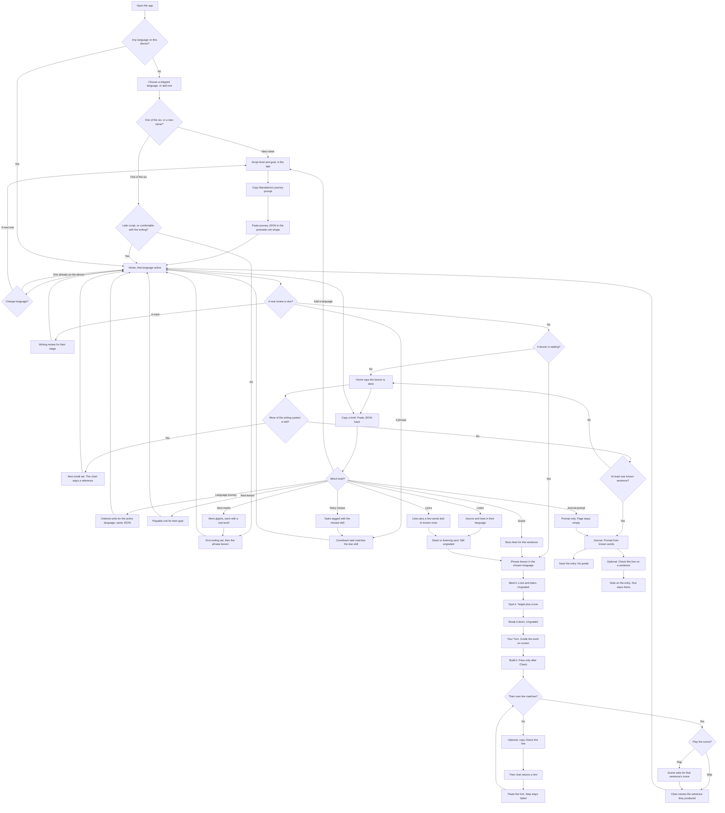

# Redesign — Clear flows & a real learning result

**Governs:** the next pass over the running app. Phase 1 and Phase 2 stay the build plans. This plan amends them where the built slice is clear to tap and unclear to trust, and where finishing a session does not leave a skill.

**Evidence:** [existing-app analysis](../existing-app-analysis.md), especially the flow review: the Indonesian/Spanish Start path is easy to follow; goal, script level, locked abilities, progress labels, and the second session are not; a completed session can feel finished without the sentence having been learned.

**North star (unchanged):** the learner should not have to understand the scheduler.  
**Amendment:** the learner must be able to trust the path. A screen that says “you can” or “next we will” has to be true. A logged success has to be a retrieval, not a tap that advanced the screen.

Check a box only when that behavior is in the running app.

| Phase | What it ships | Start when |
|---|---|---|
| [R1 Language parity](#r1--language-parity) | The same first lesson in ja, zh, ko, ar, es, id. Samples follow the language. | Now |
| [R2 Honest path](#r2--honest-path) | Goal, script gate, progress labels, and the screen after clear say what is true | R1 done |
| [Readings on the script](#readings-on-the-script) | Furigana on every kanji, pinyin on every Chinese character, vowel marks on beginner Arabic | Now. Applies again to every later string in those languages |
| [Writing charts](#writing-charts) | A reference chart for each non-Latin script, character plus reading, like a hiragana table | Now. Not a graded lesson |
| [Writing progress](#writing-progress) | The writing system in small sets, reviews that come back, and a check that matches the stage | Charts done. Can overlap R3 |
| [Stroke order](#stroke-order) | Non-Latin marks show the strokes in order. A trace passes only when the ink is that character | Now. On the device. No handwriting model |
| [R3 Real grades](#r3--real-grades) | A success is logged only for a retrieval | R1 done. Can overlap the end of R2 |
| [R4 Honest claims](#r4--honest-claims) | Celebration and “I can…” match those reps | R3 done |
| [R5 Clipboard coach](#r5--clipboard-coach) | Journeys and the other paste jobs. A paste is not a grade | R1–R4 done for all six languages |
| [Lyrics](#lyrics) | A song’s lines, and a short word list tied to words they already know. A paste is not a grade | R5 paste contract. The page can be specified before that |
| [R6 Journal](#r6--journal) | Entries that use known words. Saving is not a grade | R4 done. Prompt paste can wait for R5 |
| [R7 Languages you can leave](#r7--languages-you-can-leave) | Switch among languages on this device. A new one is a journey Mandarina’s own prompt asked for, in the same shape as a premade path | Now. The app still does not call a model |
| Later | Live talk (the old Phase 2). Not this pass | R1–R4 done. No proxy before that |

Do not ship the first lesson for Indonesian or Spanish alone. Do not add a hand-authored second ability. Do not call a model from the app.

---

## What “done” means

A new learner can answer, from the screen alone:

1. What am I learning in this session?
2. Why this, given the goal and script level I chose?
3. What do I have to actually do — listen, recognize, build, say?
4. What can I do when the celebration ends?
5. What is the next session, and what brings me back?
6. Which language is this, and how do I study another one without losing this one?

A completed phrase session leaves one true ability: the learner retrieved the sentence (meaning and form) without the app typing it for them. Progress copy describes that, and does not describe skills that have no lesson.

The language chosen at the start is not permanent. More than one language can live on the device. One is active. Leaving it does not erase it.

---

## Flow

One learner, many languages on this device, one active at a time. No server. A paste never counts as a success. Saving a journal entry never counts as a success. Switching language never counts as a success.

| Use case | Where it enters | What comes out |
|---|---|---|
| First visit, one of the six | Choose language. Nothing is preselected | Home, in that language. The other five stay available to add later, with no paste |
| First visit, any other language | Name it, then copy the journey prompt Mandarina filled in. Paste the reply | A journey in the same unit shape as Japanese or Spanish, stored as that language. Unit 1 can start. Later units stay locked |
| New to a non-Latin script | First writing set, then the phrase lesson | Phrase lesson unlocks. The rest of the script stays ahead, in sets |
| A mark is due | Home review, before a new row | The task matches the stage. A miss comes back. The chart tap does not count |
| Ready for the next row | Journey script rail, or Home when nothing else is due | The next set only. Later rows stay locked |
| Comfortable with the writing | A shorter check, aid hidden on marks they have retrieved | Not a poster quiz of the whole system |
| Trace a non-Latin mark | Trace It | The strokes are numbered, in taught order. A pass is that character, not a long scribble |
| Daily lesson | Home Start | One sentence retrieved, then an honest next step |
| Near-miss while saying the line | Check this line | A hint. The step stays failed |
| Scene | Optional boss, or a pasted scene | The question matches the sentence. Skip is not a win |
| Come back later | Due card on Home | The task matches the skill that is due |
| Nothing left to study | Parked Home | “Lesson done,” not “Continue” on the same sentence |
| Use the words | Journal | A saved entry. Word count is not a score |
| Leave the language they are in | Languages list on Home | The other language’s Home. Lessons, stash, journal, writing progress, and due cards stay with the language they left |
| Come back to a language | Same list | That language’s Home, not day one, and not onboarding again |
| Change script level or goal | On that language’s card | The new choice applies to that language only. Retrieved units stay retrieved |
| A language the app did not ship | Mandarina’s journey prompt for that name, then the paste | Units the lesson loop already runs. The language is its own place. A French pack is not stored inside Japanese |
| Grow the active language | The same journey prompt, or next-lesson | More units in that shape, after the lesson they already have. The paste does not create a second language |
| Extend the script | Next marks paste | The warm-up can leave the first glyph |
| Bring their own audio | Listen briefs | Cards and stash rows in their language |
| A song they already like | Lyrics. Paste the lines, or a brief that extracts words | A few words tied to ones they know. Stash is not a grade |

---

## R1 — Language parity

The chooser lists six languages. The running app then funnels people toward Indonesian.

| Bias | Where |
|---|---|
| Default selection is Indonesian | `OnboardingPage` `useState<LanguageId>('id')` |
| The only Latin-script example in the guide is Indonesian | “including ones that use the same Latin letters… (like Indonesian)” |
| Phrase content exists for Japanese, Indonesian, and Spanish only | `PHRASE_UNITS` |
| Dictionary lookup is eight Japanese entries for every language | `DICTIONARY_SUBSET` |
| “Try a sample” on Stash and Listening pastes Indonesian (Jakarta street video, *Saya lapar*) | `SAMPLE_PACK_JSON`, `SAMPLE_TUTOR_PACK_JSON`, `SAMPLE_SOURCES_PACK_JSON`, `SAMPLE_LISTEN_TRANSCRIPT`, `SAMPLE_LISTEN_LINES_JSON` |

Spanish is not the funnel. It is the other language that already has a sentence. Japanese has a sentence the `"new"` script gate never opens. Mandarin, Korean, and Arabic stop at one glyph.

**Rule:** picking a language is the whole choice. After that, every sample, gloss, dictionary hit, and lesson line is in that language. No language is the demo, and none is a shell.

This phase adds the **same first lesson** to Japanese, Mandarin, Korean, and Arabic that Indonesian and Spanish already have. It does not add a longer course. It does not leave Indonesian samples in place and call that a translation.

For each of the six languages, the first unit has:

- One natural sentence for the same move (state that you have work today, or answer “what are you doing today” — one speech act, shared with the boss scene).
- A gloss, reading where the script needs it, chunks a learner can rebuild, and a meaning question whose correct card is the word on screen.
- A script warm-up that still starts from the marks for non-Latin scripts, then opens this unit. Latin-script languages stay phrase-first.
- Stash and listening samples written in that language. The dictionary subset is that language’s words, not the Japanese eight for everyone.

Indonesian’s current line (*Hari ini saya ada kerja*) is replaced with a line a speaker would actually use, same as the other five. It is not the template the other languages imitate.

### Checklist

- [x] Cold open does not preselect Indonesian
- [x] The guide names Indonesian only when that card is selected
- [x] Japanese has a natural first sentence, gloss, reading, chunks, and a meaning question on the word shown
- [x] Mandarin has the same shape
- [x] Korean has the same shape
- [x] Arabic has the same shape
- [x] Spanish has the same shape
- [x] Indonesian’s line is one a speaker would use, not *Hari ini saya ada kerja*
- [x] Each sentence and its boss ask are the same speech act
- [x] Dictionary search uses that language’s words
- [x] Stash sample pack is in the active language
- [x] Tutor-pack sample is in the active language
- [x] Listen transcript sample is in the active language
- [x] Listen-lines sample is in the active language
- [x] A Japanese profile’s samples contain no Indonesian and no Spanish
- [x] The same check holds for Mandarin, Korean, Arabic, and Spanish
- [x] Each of ja, zh, ko, ar, es, id can Start a phrase session whose target is in that language

---

## R2 — Honest path

The happy path for a Latin-script beginner stays one Home hero and one continuous session. These are the places that path currently lies or stalls.

| What the learner is told | What happens now | Rule |
|---|---|---|
| Goal “steers today’s path” (`OnboardingPage`) | Every goal gets the same work-today sentence | The goal either changes the unit, or the confirm screen stops saying it steers the path. A goal with no unit is not offered as if it were. |
| New to a non-Latin script: warm-up, then phrases | `scriptFamiliarity` stays `"new"`; Home never unlocks the phrase hero | Finishing the warm-up opens the phrase unit for that language. |
| Six languages, six “I can…” skills | Introduce / food / appointments stay locked forever | Journey and Progress show abilities that have a unit. Locked cards with no lesson are not listed as the course. |
| “Level N” and “N day journey” | Level = done cards + 1. Day count increments per clear, including twice in one day | Those labels match the thing counted, or they are removed. A checkpoint uses “lesson cleared,” not a fake level. |
| After All Clear, Start again | Same sentence, same hero | Home after clear says this lesson is done and names the real next step: the next unit if one exists, or an honest end (“this is the lesson we have”) plus comeback when something is due. |
| Script warm-up done | `intro` (“Introduce yourself”) flips to `partial` though no introduction was taught (`advanceScriptFrom`) | Clearing the warm-up updates only the script ability that was practiced. |

There is still no notification system in this phase. The return rule is narrower:

- The second open must not look like day one of a new course.
- If a real review is due, Home says so in human language and the session does that review before or inside the next real step.
- If nothing is due and no next unit exists, Home says the lesson is done.
- `journeyDay` is not the cue and is not shown as a streak of calendar days.

### Checklist

- [x] Confirm copy no longer says the goal steers the path, unless the goal actually selects a different unit
- [x] A goal with no unit is not offered as a path
- [x] Japanese, script `"new"`: finishing the warm-up opens the phrase unit with no settings screen
- [x] Mandarin, Korean, and Arabic do the same
- [x] Warm-up clear does not set “Introduce yourself” to partial
- [x] Journey lists only abilities that have a unit
- [x] Progress lists only abilities that have a unit
- [x] “Level N” is removed or renamed to the thing it counts
- [x] “N day journey” is removed or no longer increments on every clear
- [x] After the only unit is cleared and nothing is due, Home does not say “Continue your lesson”
- [x] Home names the real next step: next unit, comeback, or “this is the lesson we have”
- [x] A due card on a later open is the Home hero, in human language
- [x] That session reviews the due item before or inside the next real step
- [x] Opening the app the next day does not look like day one of a new course

---

## Readings on the script

The first lesson now shows the aid on the sentence. 今日 and 仕事 carry furigana. 我今天上班。 carries pinyin on each character. The Arabic line is stored and shown as أَنَا أَعْمَلُ الْيَوْمَ, with the vowels on the letters and the Latin reading not drawn on the word. Hiragana and katakana stay bare.

Dictionary rows, sample packs, pasted words, and the journal word list use that same aid. A word that needs it and does not have it is not shown and is not imported. Korean, Spanish, and Indonesian do not get this aid. Spanish’s sentence is “Hoy yo trabajo.” so Spot It has a lure.

Each script gets the aid learners of that script actually use. Hangul and the Latin alphabet are already the reading.

### Japanese — furigana

Every kanji has furigana. Hiragana and katakana do not. The reading sits on the kanji. It does not replace the word.

今日 carries きょう and 仕事 carries しごと. は, を, and します stay plain. The same ruby is on the sentence, Spot It, Build It, Your Turn, the boss line, dictionary rows, and sample packs.

A kanji with no reading is not shown bare. A pasted Japanese word that contains kanji must include its reading, or that word is rejected.

### Mandarin — pinyin

Every character has pinyin on it, the way furigana sits on kanji: 我 wǒ, 今 jīn, 天 tiān, 上 shàng, 班 bān. Tone marks stay on the pinyin. It is not a second line under the sentence, and it does not replace the characters.

The same ruby is on every Mandarin surface the learner reads. A character with no pinyin is not shown bare. A pasted Mandarin word must include pinyin for each character, or that word is rejected. Zhuyin is not this pass.

### Arabic — vowel marks

Arabic does not get a second script above the letters. Beginner words are shown with tashkeel, the short-vowel marks on the letters themselves. أنا أعمل اليوم。 is stored and shown vocalized, not as a bare consonant string plus a Latin line.

The Latin reading (`al-yawm`, `aʿmal`) can stay in the data. It is not drawn on the word. A pasted Arabic word aimed at a new reader must include the vowel marks, or that word is rejected.

### Checklist

- [x] 今日は仕事をします。 shows きょう on 今日 and しごと on 仕事
- [x] は, を, and します have no furigana
- [x] Spot It, Build It, and Your Turn use that same ruby, including any kanji lure
- [x] 我今天上班。 shows pinyin on each character, with tone marks
- [x] Mandarin dictionary rows and sample packs do the same
- [x] أنا أعمل اليوم。 is shown with vowel marks on the words
- [x] Arabic dictionary rows and sample packs are vocalized the same way
- [x] The Latin reading is not drawn on the Arabic word
- [x] A Japanese kanji, a Chinese character, or a beginner Arabic word with no reading aid is not rendered
- [x] Journey and next-lesson briefs require that aid, and a paste without it does not import that word
- [x] Journal word lists use the same aid
- [x] Korean, Spanish, and Indonesian are shown without furigana, pinyin, or vowel marks

---

## Writing charts

Japanese, Mandarin, Korean, and Arabic each get a chart the learner can open and read. It is a reference, not a quiz. Nothing on it logs a success. Latin-script languages do not get one. Indonesian and Spanish stay on the phrase path.

The model is a hiragana table: a grid, one large character per cell, a small reading under it, rows and columns in the order that script is taught. The learner can open it from the writing warm-up and from the script rail on Journey. Tapping a cell may play that sound. It does not advance a lesson.

The warm-up still introduces one set at a time. The chart is the map of the whole system. Moving through that map, and bringing marks back, is [Writing progress](#writing-progress).

### Japanese

Two charts, same grid. Hiragana first, katakana as a second sheet.

The basic sheet is the gojūon, the table in the reference image:

- Rows あ い う え お, か き く け こ, さ し す せ そ, た ち つ て と, な に ぬ ね の, は ひ ふ へ ほ, ま み む め も, や ゆ よ, ら り る れ ろ, わ を, and ん.
- Each cell is the kana large, the romaji small underneath (a, i, u, e, o, ka, ki, …).
- Empty corners stay empty. や ゆ よ do not grow fake i/e columns.

A second sheet adds dakuten, handakuten, and the small-ya combinations. It is not crammed into the first view.

### Mandarin

Hanzi is not one closed table. The chart for this pass is the **pinyin table**: initials down the side, finals across the top, and each legal syllable in the cell with its tone-less spelling. That is the closed set a beginner can scan, the way the gojūon is.

There is no poster of every character. A short “first characters” strip can sit under the table for the five marks already in the warm-up (人 口 日 月 木), each with pinyin. It does not pretend to be the writing system.

### Korean

One hangul chart in two bands, then a block grid.

- Consonants in textbook order: ㄱ ㄴ ㄷ ㄹ ㅁ ㅂ ㅅ ㅇ ㅈ ㅊ ㅋ ㅌ ㅍ ㅎ, each with its sound underneath.
- Vowels: ㅏ ㅑ ㅓ ㅕ ㅗ ㅛ ㅜ ㅠ ㅡ ㅣ, each with its sound.
- Under that, a block grid of consonant plus vowel, starting 가 나 다 … so a cell is a real syllable, not a loose jamo.

### Arabic

One letter chart, right to left. Each letter shows the four shapes a learner has to recognize: isolated, initial, medial, final. The isolated form alone is not enough. Under the row, the letter’s name and sound. The first sheet is the alphabet in order, not the five isolated letters the warm-up drills now.

### Checklist

- [x] A Japanese learner can open a hiragana gojūon chart with romaji under each kana
- [x] Katakana is the same grid on a second sheet
- [x] Dakuten and small-ya are a separate sheet, not squeezed into the basic table
- [x] A Mandarin learner can open a pinyin initial-by-final chart
- [x] That chart does not claim to list every character
- [x] A Korean learner can open consonants, vowels, and a syllable-block grid
- [x] An Arabic learner can open the alphabet with isolated, initial, medial, and final shapes
- [x] The chart is reachable from the writing warm-up and from the Journey script rail
- [x] Tapping a cell does not log a success and does not clear the warm-up
- [x] Indonesian and Spanish do not show this chart

---

## Writing progress

The chart is the map. It stays a reference, and tapping a cell still does not count. The warm-up today stops after one mark. This section is the path through the rest of the writing system: a small set, then a check, then the marks come back later. The learner never sees an interval or a level number.

Indonesian and Spanish do not get a character chart. They get the same shape on the sounds they already practice (ng, ny, ñ, and the rest of that short list).

### Sets, in taught order

A set is a handful of marks, not the whole table. The next set stays locked until this one is retrieved. Opening the chart does not unlock it. Pasting “next marks” can append a set. It does not clear the one they are on.

- **Japanese.** Hiragana gojūon, one row at a time: あいうえお, then かきくけこ, and so on through ん. Dakuten, handakuten, and small-ya are the next sheet, still in rows. Katakana repeats that order on its own sheet. A row is not mixed with the sheet that comes after it.
- **Mandarin.** The pinyin table, a few syllables at a time: one initial down a row, or one final across. Then the short strip 人 口 日 月 木, each with pinyin. There is no set that claims to cover every character.
- **Korean.** Consonants in textbook order, then vowels, then syllable blocks starting 가 나 다. A block set does not start until the jamo in it have been retrieved.
- **Arabic.** The alphabet in order. Early sets use the isolated letter. Later sets use that letter’s initial, medial, and final shapes. The isolated form alone is not the whole test.

Script familiarity chooses the starting set, not a displayed rank. **New** starts at the first set. **Some** may start a few sets in, and still reviews the earlier marks. **Comfortable** may start at the later check, and still has due marks. Skipping ahead does not mark the skipped marks as known.

### Reviews come back

Each mark the learner has actually retrieved gets a card. A due mark shows on Home before a new row, in ordinary language (“A few marks are ready”), with a small cap, same idea as a phrase comeback. A miss schedules the mark again. A clean retrieval schedules the next gap. A hint does not write a second rating. Reveal still advances and still schedules Again.

The chart, Meet, and Hear do not rate the card. A scribble is not a writing success. Matching the ink to that character’s strokes is [Stroke order](#stroke-order).

### The check depends on the stage

The stage is how far they are in the sets, plus the familiarity they chose. The screen does not say “Level 3.”

| Stage | What they are asked | What they are not asked |
|---|---|---|
| First sets, familiarity new | See the mark, pick its reading from three, one of them a lure. Or hear the sound and pick the mark. The prompt does not print the answer. | A grid labeled with the reading. Ink. The whole table at once |
| After a few sets, or familiarity some | The reading is not on the mark. They pick the mark from a lineup, or type the reading. Arabic: which shape of this letter is in the word. | The isolated letter as a free pass once shapes are the set. Furigana or pinyin sitting on the mark being tested |
| Basic sheet done, or familiarity comfortable | A short mixed check: due marks, plus at most one new row. On a word they already know, the aid can be hidden for a mark they have retrieved (the kana, the syllable, the letter shape). Kanji furigana, per-character pinyin, and Arabic vowel marks stay on everything they have not retrieved. | A test of every cell. Hiding the aid on a mark they have only seen on the chart |

A failed check stays on that set. The next row does not open. Finishing a writing set does not mark a speaking ability done.

### Checklist

- [x] Home names the next writing set in words (“か row”), not as a level
- [x] Only the first unretrieved set can start. Later rows stay locked
- [x] Familiarity new starts at the first set. Some and comfortable may start later, and earlier marks are not marked known
- [x] A retrieved mark comes back on Home when it is due, before a new row
- [x] The review cap stays small, and the screen does not show an interval
- [x] A chart tap, Meet, or Hear does not log a success
- [x] An early check asks for the reading or the mark, with a lure, and does not print the answer
- [x] A later check hides the reading on the mark being tested
- [x] An Arabic later check asks for the shape in the word, not only the isolated letter
- [x] A comfortable check can hide the aid only on marks they have retrieved
- [x] A miss or a reveal does not open the next set
- [x] Indonesian and Spanish use this shape for their sound list, and still have no character chart
- [x] Finishing a writing set does not mark a speaking ability done

---

## Stroke order

Trace It draws a faded copy of the whole mark. The step passes when the ink is one stroke and at least 70px long (`inkLooksWritten` in `writing.ts`). A line, a scribble, or a different character all pass. The learner never sees which stroke comes next.

Japanese, Mandarin, Korean, and Arabic show the stroke order, and a trace passes only when the ink is that character. Indonesian and Spanish do not get a stroke-order diagram. Their letter practice still has to be the mark they were asked to write, not a 70px scribble.

### The order is on the page

On Trace It the mark is its strokes, in the order that script teaches them. Each stroke has a number, a start dot, and a direction. The stroke to draw now is the loud one. A stroke they already matched stays on the page. The next number appears when the current stroke matches.

Copy keeps that order, lighter. From memory hides the numbers and the guide. The check is still that character.

A chart cell can show the same order. Watching it, or tapping the cell, does not log a success and does not clear the warm-up.

Arabic stays right to left. The numbers follow the letter’s own stroke order, not the direction of the line. A hangul block shows the jamo strokes in textbook order, consonant then vowel. Each kana has its own list. The Mandarin marks in the warm-up (人 口 日 月 木) each have their own list. A character in a sentence is not a trace target until it is a mark in a set.

### The ink has to be that character

Length is not the character. `inkLooksWritten` is not a match.

A stroke matches the current stroke when it starts near that stroke’s start, moves in the same direction, and ends near that stroke’s end. A shaky hand and a different size still count. A different shape, the wrong stroke, or the strokes out of order do not.

Trace It passes only after every stroke of that character is matched, in order. Tracing あ does not pass for い. A long scribble does not pass for 人. Copy and From memory use the same strokes. From memory fails when the ink is a different character, and the hint can show the numbers again. Showing the numbers is not a pass.

A writing Good is logged only for that match. Reveal still advances and still schedules Again. Seeing the order, undoing, and clearing the canvas do not log a success.

The strokes are stored with the mark. The app does not send the ink to a model. An added language shows this order only when a prompt Mandarina wrote comes back with those strokes in a shape the canvas can draw. A mark with no strokes does not fall back to the length check.

### Checklist

- [ ] Japanese Trace It shows each kana’s strokes in order, with a number, a start, and a direction
- [ ] Mandarin Trace It does the same for 人 口 日 月 木
- [ ] Korean Trace It shows jamo strokes, then a block, in textbook order
- [ ] Arabic Trace It shows the letter’s strokes in taught order
- [ ] The current stroke is the one on screen, and a matched stroke stays
- [ ] Indonesian and Spanish do not show this diagram
- [ ] A chart cell can show the same order, and that view does not log a success
- [ ] A 70px scribble does not pass Trace It, Copy, or From memory
- [ ] Tracing a different character does not pass
- [ ] Strokes out of order do not pass Trace It
- [ ] A pass is every stroke of that character, in order
- [ ] A writing Good is logged only for that match
- [ ] Reveal still advances and still schedules Again
- [ ] A mark with no stored strokes does not use the length check

---

## R3 — Real grades

The first lesson is one sentence, in whichever language they chose. This phase does not add a second ability. It makes that sentence a real rep in all six languages, and stops recording fake ones.

| Step | Demand that may log success | Must not log success |
|---|---|---|
| Meet It | None. Exposure stays ungraded. Optional audio stays optional. | “Got it” → listening Good |
| Spot It | Tap the targets inside the sentence. The sentence also contains at least one piece that is not a target. A wrong tap can fail. The form on the piece matches the form in the sentence. | A row of only the two answers, detached from the sentence |
| Break It Down | None. Worked example, ungraded. | — |
| Your Turn | Meaning of the word on screen, stored on **that** item. Today the prompt is 仕事 / kerja / trabajo and the card is item 0 (today). | A Good on a different item |
| Build It | Chunk order of the sentence, stored on the sentence (or each chunk the learner placed), not only on item 0. Success only after the learner commits with Check. | A matching order that skips Check and shows success as soon as the last chunk lands |
| Say It | The learner’s own typed string matches. The placeholder does not contain the target’s opening tokens. Live speech, if used, is the transcript they actually produced. | Mock listen writing the target into the field and then Check. A placeholder such as `今日は…` / `Hari ini…` |
| Script Spot | Find the glyph in a lineup whose prompt does not already print that glyph. | “Find あ” above a grid that contains あ |
| Script Hear / Use | Hear stays ungraded. If audio plays, it speaks the glyph or the word, not the reading label (“a”, “rén”). Use is a retrieval (find or read the glyph in a word without the glyph printed as the search key) or it is ungraded. | Button press → listening or contextualUse Good. TTS of the romanization |
| Boss brief | The scene states the situation. It does not list the full target sentence as a cheat sheet before the learner answers. | `brief.targets` showing the sentence, then the chat asking for it |
| Ink | A writing Good only when the ink matches that character’s strokes, in [Stroke order](#stroke-order). Until that match exists, ink does not log writing Good. A scribble past 70px is not a character. | `inkLooksWritten` → success |
| Boss | Optional. If played, the prompt asks for the speech act the sentence performs. Skip does not celebrate use. | “What are you doing today?” scored against “I have work”; substring / 4-character prefix counted as use |
| Comeback | The task matches the due facet (meaning, form, or listen). Cap stays small. | A due writing card reviewed as an English gloss tap |

Reveal still advances and still schedules an Again. Hint does not also write a second rating on every tap.

### Spot It

The current screen is not a search. For 今日は仕事をします。 the guide says “Tap the pieces that mean today and work.” Under the sentence sit two chips, 今日 and 仕事, and nothing else. Both are correct, both check off, and the button says “Nice — now let's make sure you can find them again.” Stash appears as soon as one chip is tapped.

What makes it confusing:

- There is nothing to find. The only pieces are the answers.
- The chips are not in the sentence. 今日 is not the same form as 今日は, and 仕事 is not 仕事を, so a beginner cannot see which part of the line they tapped.
- The button talks about finding them again. This step was supposed to be the finding.
- Stash is a second task in the middle of the first one.

**How this step works after R3**

- The sentence is the lineup. Each chunk that is already in the sentence is tappable, in place: for this line, 今日は, 仕事を, and します.
- The guide names the meanings (“today” and “work”). It does not print the target chunks.
- At least one chunk is a lure. Tapping します is a miss. Tapping 今日は and 仕事を is the hit.
- The chunk the learner taps is the same string they see in the sentence.
- A wrong tap can fail, with the same hint / retry / reveal path as Your Turn. Success is not available until the targets are chosen and no lure is selected.
- Stash is not on this step.
- The continue button names the next step. It does not claim they will find the words again.

The same shape applies in every language: the chunks of that sentence, targets plus at least one lure, tapped inside the line.

The boss line and the target have to be the same move. Either the scene asks whether the learner has work today, or the target is a sentence a speaker would use to answer “what are you doing?”

### Checklist

- [x] Meet It does not log a listening Good
- [x] Spot It is tapped inside the sentence, and each chunk matches the form in the line
- [x] Spot It includes at least one lure, and a wrong tap can fail
- [x] Spot It does not offer Stash mid-task
- [x] The Spot It button does not say the learner will find the words again
- [x] Break It Down stays ungraded
- [x] Your Turn stores the grade on the word on screen (仕事, not 今日, for the Japanese seed)
- [x] Build It shows success only after Check
- [x] Build It’s grade is on the sentence or the chunks placed, not only item 0
- [x] Say It’s placeholder does not contain the target’s opening tokens
- [x] Mock listen does not fill the target and then pass Check
- [x] Live speech, when used, grades the transcript the learner produced
- [x] Script Spot’s prompt does not print the glyph being sought
- [x] Script Hear does not log a listening Good
- [x] Script Hear, if it plays audio, speaks the glyph or the word, not the reading label
- [x] Script Use does not log contextualUse for a button press
- [x] Boss brief does not list the full target sentence before the reply
- [x] Boss asks for the speech act the sentence performs
- [x] Boss skip does not celebrate use and does not log success
- [x] Boss no longer treats a 4-character prefix or any 2-character item as a hit
- [x] Ink does not log a writing Good
- [x] Comeback’s task matches the due facet
- [x] A due writing card is not reviewed as an English gloss tap
- [x] A hint tap does not write a second rating
- [x] Reveal still advances and still schedules Again
- [x] Ignoring audio, tapping Spot, and using the mock mic does not create listening, recognition, or production Goods
- [x] The same grading rules hold for zh, ko, ar, es, and id, not only Japanese

---

## R4 — Honest claims

- “I can say this sentence” only if Say It was the learner’s own production.
- “I can read this mark” only if that glyph was retrieved, not if they traced glyph 0 of five and tapped through.
- Listening and speaking stay in the path as demands when the ability is “talk.” TTS the learner never had to respond to is not listening skill. A mic the app speaks for them is not speaking skill.
- Stroke checks and live conversation stay later. This phase stops claiming those skills early.

### Checklist

- [x] The celebration names the sentence the learner produced
- [x] The celebration does not show a level
- [x] “I can…” appears for the sentence only after their own Say It production
- [x] “I can read this mark” appears only after that glyph was retrieved
- [x] Script clear does not mark a speaking ability done
- [x] Progress does not describe introduce / food / appointments as skills in progress

---

## R5 — Clipboard coach

The copy-out / paste-back loop is the product’s model call. The app never talks to an LLM. The learner copies a brief, runs it in their own chat, and pastes the reply. Today the loop only does four jobs, and three of them are “find or chop an Indonesian listen”:

| Brief today | Paste becomes |
|---|---|
| Progress / tutor pack (`snapshotTutorBrief`) | Loose stash rows, not a playable lesson |
| Find a listen | A source card |
| Pull lines / process words | More stash rows from a transcript |

The learner context is already in the brief: language, goal, script level, known lines, and up to six weak spots (`collectLearnerContext`). The lesson does not use the paste as a lesson. The new jobs use that same contract.

**Shared contract**

- One control: copy the brief. One control: paste the reply. The app pulls the first JSON object or `json` fence out of the paste (`extractJsonValue`). Extra prose from the chat is ignored.
- Every brief names the learner’s language and says: reply in that language for the L2, English only for glosses, JSON only, no other language’s examples.
- The sample paste on each control is in the active language. Indonesian samples do not appear on a Japanese profile.
- A paste never logs a success. It adds something the learner still has to retrieve.
- A paste that fails the shape shows what was wrong with the JSON. It does not half-import.

| Job | Learner copies | Paste adds | Why this, not a server |
|---|---|---|---|
| **Language journey** | The prompt Mandarina wrote: active language, goal, script level, and the exact unit JSON | Ordered units in that JSON. Each unit has a sentence, gloss, reading if the script needs it, chunks, a meaning question on the word it asks about, a lure, and a boss prompt for that sentence’s speech act | The chat fills a shape the app already plays. It does not invent a course format. A language the app did not ship uses this same prompt, then becomes its own language in [R7](#r7--languages-you-can-leave). |
| **Next lesson** | Language, goal, known sentences, weak spots, and “one new move, reuse words they have” | One playable unit in the same shape | One step when they do not want a whole path. Goal changes what that step is. |
| **Check this line** | What they typed, the target, and the facet they missed (particle, word order, register — not a score) | A short diagnostic: what differs, one corrected line, one hint that does not reveal on the first line | Say It is exact-match. The external chat can explain a near-miss. Check still passes only if the learner’s own text matches. |
| **Scene for this line** | The target sentence and its gloss | NPC opener and two follow-ups that ask for that speech act, in the learner’s language, plus an English stage direction | Replaces a canned English question that does not match the sentence. |
| **Retry these misses** | The weak-spot list with facet (hear / say / write / meaning) | Up to three tasks, each tagged with the facet. A writing miss comes back as a writing task, not an English gloss quiz | Comeback must not ignore the due facet. |
| **Next marks** | Script they already drilled, language, “five next marks, each with a real word” | Glyph, reading, hint, use-word, use-gloss. The script session can leave glyph 0 | The warm-up list is five static marks and the session plays one. |
| **Journal prompt** | Known words, goal, and “one prompt I can answer with only these words” | `{ "prompt": "...", "use": ["..."] }` | The app shows the prompt. It does not write the entry. Built in R6; the paste lands here. |
| **From these lyrics** | Language, known words, and the lyric lines they pasted (or a title plus “I will paste the lyrics next”) | `{ "title", "lines": ["..."], "words": [{ "surface", "reading?", "gloss", "line", "relatedTo?" }] }` | The chat picks a few words worth keeping and ties each one to a word they already have when it can. The app does not fetch the song. |

**How a pasted journey is played**

- The app stores the units on the device and runs them through the same lesson loop as a shipped sentence.
- Only the first undone unit is the Home hero. Clearing it by retrieval unlocks the next. Pasting the pack unlocks nothing.
- Units the paste did not include are not shown. A French journey does not add French cards to a Japanese profile.
- A later paste can append units. It does not reset units they already cleared.
- The brief is the prompt. The learner copies it. They do not write their own. The reply has to be the unit JSON that brief asked for, so the session can run it the way it runs a shipped sentence. An essay, a syllabus, or a different schema is not a journey.
- Naming another language in this box does not switch the profile. Today that paste is stored under the active language’s journey key (`journey-v1:` plus that language id). R7 is the job that gives the new name its own language. Until then, this checklist’s “language outside the six” item means a pack of units, not a language the learner can leave and come back to.

Listening briefs stay. They are not Indonesian-only, and they are not the only reason to open the coach.

### Checklist

- [x] Every brief names the active language and forbids examples from other languages
- [x] Sample paste on each control is in the active language
- [x] Invalid JSON shows the error and imports nothing
- [x] A paste never writes a Good
- [x] Language journey: a language outside the six can be named, brief copied, pack pasted
- [x] That paste stores ordered units and Home starts unit 1 only
- [x] Unit 2 stays locked until unit 1 is cleared by retrieval
- [x] A second journey paste appends and does not reset cleared units
- [x] Next lesson paste adds one playable unit for the learner’s goal
- [x] On a Korean profile, a next-lesson or journey paste contains no Indonesian
- [x] Check this line shows a hint on a Say It near-miss and leaves the step failed
- [x] Scene paste replaces the boss opener with a question that sentence answers
- [x] Retry these misses turns a writing miss into a writing task, not a gloss MCQ
- [x] Next marks paste adds glyphs the script session can drill after glyph 0
- [x] Listen briefs still work, in the active language
- [x] From these lyrics returns lines and a short word list in the active language
- [x] A word with no required reading aid is not imported
- [x] That paste does not write a Good

---

## Lyrics

A song the learner already likes is a source of words, not a second course. The app does not play the track, search for it, or download lyrics. They keep the music in whatever player they already use. They bring the lines.

- Open Lyrics from Home, next to Listen. With no lines yet, the page asks them to paste lyrics in the language they are learning. It does not offer a sample from another language.
- Pasted lines are stored on the device as a source: title if they gave one, then the lines. Saving the lines is not a success and does not clear a lesson.
- **From these lyrics** (the R5 brief) sends those lines plus the words they already know. The paste back is a short list, not the whole song turned into a dictionary. Cap it at about eight words.
- Each word has the surface, a gloss, and the lyric line it came from. Japanese kanji need furigana, Chinese characters need pinyin, beginner Arabic needs vowel marks. A word missing that aid is skipped, same as any other paste.
- Relate before they stash. If the surface is already in a lesson or the stash, say so and do not add a duplicate. If the paste names `relatedTo` a known surface, show that known word beside the new one (“this sits next to 仕事”). A word with no relation is still listed, marked as new.
- They choose which words to keep. Stashing a word is not a Good. Stashing a line as a phrase uses that lyric line as the example sentence, so Build It and Say It can unlock later the same way as any other stash row with an example.
- A kept word still has to be retrieved. It shows up as stash practice or a comeback, not as a finished song lesson.
- The page can show the line with the new word highlighted. It does not grade singing, listening along, or tapping the line.

### Checklist

- [x] Lyrics is reachable from Home, beside Listen
- [x] Pasting lines stores them on the device and does not add a Good
- [x] An empty page does not show another language’s sample song
- [x] From these lyrics asks for a few words, not every word in the song
- [x] Each kept word shows the lyric line it came from
- [x] A Japanese kanji, a Chinese character, or beginner Arabic without its reading aid is not imported
- [x] A word they already have is marked as known and is not stashed again
- [x] A new word can sit beside a known word when the paste names that link
- [x] Stashing a word or a lyric line does not write a Good
- [x] A stashed lyric line can later be built and said, because the line is its example
- [x] The page does not play audio and does not fetch the song
- [x] On a Korean profile, the lyrics sample and the word list contain no Indonesian

---

## R6 — Journal

A journal is where the learner uses words they already met. It is not a new course and not a grade.

- Open Journal from Home after at least one sentence is known. Empty state says they need a lesson first. It does not offer a blank page with no words.
- Each entry is a short text in the language they are learning. The app shows the words and sentences already in that language (the lesson line, stashed phrases, pasted units) beside the page so they can reuse them.
- A prompt sits above the page. It is one concrete ask, in English, that those words can answer. The prompt names the move. It does not print the target sentence.
- They write, save, and can reopen past entries. Entries stay on the device with the rest of the profile.
- The app suggests a prompt from the goal, the sentence they cleared, and stash glosses. A learner with only “I have work today” gets a prompt about today and work, not about ordering food.
- **Prompt for my journal** (the R5 paste) replaces the suggestion. The text area stays empty until they write.
- Saving an entry is not a success rating and does not clear a lesson.
- The page can mark which known surfaces appear in the entry, as a quiet count (“2 of your words”). That count is not a score and not FSRS.
- **Check this line** can be run on a sentence they select inside the entry. The diagnostic comes back as a note. It does not rewrite their text.

### Checklist

- [x] Journal is reachable from Home
- [x] With no known sentence, there is no writing task yet
- [x] After the first lesson, the prompt can be answered with that lesson’s words
- [x] The prompt is not the target sentence
- [x] Known words and sentences sit beside the page
- [x] Save stores the entry on the device and does not add a Good
- [x] Past entries can be reopened
- [x] A known-word count is shown and is not a score
- [x] Pasting a journal prompt replaces the suggestion and leaves the page empty
- [x] Check this line on a selected sentence adds a note and does not rewrite the entry
- [x] A Korean journal does not show an Indonesian prompt

---

## R7 — Languages you can leave

One profile (`local`) holds one `languageId`. Onboarding writes it once. There is no way to leave it. A journey paste that names French is stored on the active language’s key (`journey-v1:` plus that id), so the app is still the language they started in.

The language is a choice they can change. A language the app did not ship is not a new kind of course. It is a journey in the shape the six premade paths already use, and only because Mandarina’s prompt asked for that shape.

### Switch

From Home, the learner opens the languages on this device. Picking one they already have loads that language’s Home: its lesson, due cards, stash, journal, and writing progress. The one they left keeps those. Coming back is not day one and does not run onboarding again.

Script level and goal belong to that language. Switching does not copy them across. Changing them later does not clear a unit they already retrieved. An open session stays on the language it started in until they leave it.

The six shipped languages are on the list without a paste. Choosing Spanish after Japanese does not need a chat.

### A new language is a premade journey

This is the same loop as every other coach job. The app does not call a model. The learner does not write the prompt.

1. They type the language name.
2. The app asks script level and goal for that language only.
3. Mandarina fills its journey prompt with that name, that goal, and that script level, and shows it. They copy that prompt into their own chat.
4. They paste the reply back. The app reads the first JSON object, the same way `parseJourneyPack` already does.

The prompt demands the JSON a shipped journey is made of:

`language`, then `units`. Each unit is `title`, `sentence`, `gloss`, `chunks`, `ask`, `askGloss`, `lure`, `boss`, and `reading` when the script needs it.

That is the object `toPhraseUnit` already turns into Meet, Spot, Break It Down, Your Turn, Build It, Say It, and the boss. The reply is not a syllabus, a dictionary, an essay, or a list of new activities. If it is not that JSON, nothing is imported. A unit missing the fields a premade unit needs is dropped. If none survive, nothing is imported. The `language` field has to be the name they gave the prompt.

Home then starts the first unit that is not retrieved. Later units stay locked until that one is cleared by retrieval. Pasting the pack unlocks nothing. A later paste of the same prompt’s shape appends units and does not reset clears.

The new language gets its own id on the device. Its journey is not written into the language they were on. French units do not show up in a Japanese lesson, stash, or journal. Samples from another language are not shown. There is no sample until a paste for this language supplies one, and that paste still has to match a prompt Mandarina wrote.

The prompt states the reading-aid rule the app already enforces: furigana on kanji, pinyin on each character, vowel marks on the letters, or none when the letters are already the reading. A word that breaks the rule is not imported. The paste cannot add a new kind of reading or a new lesson step.

A name that matches a shipped language (Japanese, Español) switches to that language. It does not create a second Japanese. A name that matches a language they already added switches to it, or appends units. It does not create a duplicate.

Adding or switching writes no Good.

### Checklist

- [ ] Home lists the languages on this device, and the active one is named
- [ ] Choosing a language they already have loads its lesson, due cards, stash, journal, and writing progress
- [ ] The language they left keeps its cleared units and the rest of that progress
- [ ] Coming back does not look like day one and does not run onboarding again
- [ ] Script level and goal are stored per language and are not copied across on a switch
- [ ] Changing script level or goal does not clear a retrieved unit
- [ ] An open session stays on the language it started in
- [ ] Japanese, Mandarin, Korean, Arabic, Spanish, and Indonesian can be chosen with no paste
- [ ] A new language starts from a prompt Mandarina filled in. The learner copies that prompt. They do not write one
- [ ] The prompt asks for `language` and `units` in the premade shape: `title`, `sentence`, `gloss`, `chunks`, `ask`, `askGloss`, `lure`, `boss`, and `reading` when needed
- [ ] A paste of that JSON becomes a journey the phrase session already runs
- [ ] An essay, a syllabus, or any other schema imports nothing
- [ ] A unit missing those fields is dropped, and a paste with no playable unit imports nothing
- [ ] Home starts unit 1 only. Later units stay locked until unit 1 is retrieved
- [ ] The paste does not write a Good and does not mark unit 1 known
- [ ] The new language has its own id. Its units are not stored on the language they were on
- [ ] A second paste appends and does not reset cleared units
- [ ] A paste whose `language` is not the name in the prompt imports nothing
- [ ] Naming Japanese or Spanish does not create a second copy of that shipped language
- [ ] A word that breaks the reading-aid rule in the prompt is not imported
- [ ] On the new language, samples and the lesson contain none of the language they left

---

## What stays out

- Hand-authored abilities beyond the first lesson. A longer path arrives as units from Mandarina’s journey prompt, in the shape the session already plays, not as a shipped Indonesian unit the other languages lack.
- A course the learner describes in their own words, or a prompt they wrote. A new language is imported only when the paste matches the journey JSON Mandarina’s prompt asked for.
- An in-app or proxy call to a model, including a handwriting recognizer. Stroke order is matched on the device against strokes stored with the mark. The coach stays copy and paste.
- Accounts, streaks, XP.
- A second visual language. Playful shell stays; copy and grading change.
- Notifications, unless a later pass adds them on purpose.
- A music player, a lyrics search, or a stream. The learner pastes lines they already have. The app does not go get the song.

---

## Trace to the flow review

Each finding from the clarity / proficiency review is a rule in a phase above.

| Review finding | Phase |
|---|---|
| Indonesian / Spanish Start path is already one clear hero | R1 keeps that spine and gives it to every language |
| Goal says it steers the path and does not | R2 |
| Non-Latin “brand new” never reaches phrases | R2 |
| Mandarin, Korean, Arabic look like a full course with no sentence | R1 |
| Locked “I can…” skills with no lesson | R2 and R4 |
| Level and day-journey are not those things | R2 |
| After clear, the same sentence is “continue” | R2 |
| Warm-up completion marks “Introduce yourself” | R2 |
| Meet and Spot count as success with no way to fail | R3 |
| Mock mic types the answer | R3 |
| Ink scribble counts as writing | R3 stops the length check from counting. [Stroke order](#stroke-order) is the match: the learner sees the order, and a pass is that character |
| Your Turn stores “work” on “today” | R3 |
| Boss asks a different speech act; skip looks like the path moved on | R3 |
| Placeholder and auto-success Build give the sentence away | R3 |
| Script Spot prints the glyph; Hear speaks “a” | R3 |
| Nothing brings the learner back, and a second open looks like day one | R2 |
| Course cannot grow without a server | R5. The prompt is Mandarina’s, and the paste is the premade unit shape |
| The language is chosen once, and another language is not its own journey | R7 |
| No place to use known words | R6 |
| A song is a wall of new words with no link to what they know | Lyrics |
