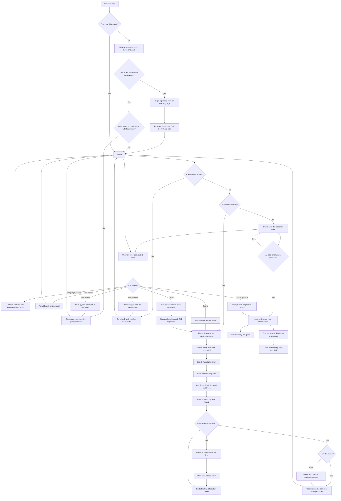

# Redesign — Clear flows & a real learning result

**Governs:** the next pass over the running app. Phase 1 and Phase 2 stay the build plans. This plan amends them where the built slice is clear to tap and unclear to trust, and where finishing a session does not leave a skill.

**Evidence:** [existing-app analysis](../existing-app-analysis.md), especially the flow review: the Indonesian/Spanish Start path is easy to follow; goal, script level, locked abilities, progress labels, and the second session are not; a completed session can feel finished without the sentence having been learned.

**North star (unchanged):** the learner should not have to understand the scheduler.  
**Amendment:** the learner must be able to trust the path. A screen that says “you can” or “next we will” has to be true. A logged success has to be a retrieval, not a tap that advanced the screen.

---

## What “done” means

A new learner can answer, from the screen alone:

1. What am I learning in this session?
2. Why this, given the goal and script level I chose?
3. What do I have to actually do — listen, recognize, build, say?
4. What can I do when the celebration ends?
5. What is the next session, and what brings me back?

A completed phrase session leaves one true ability: the learner retrieved the sentence (meaning and form) without the app typing it for them. Progress copy describes that, and does not describe skills that have no lesson.

---

## Flow

One learner, one language, no server. A paste never counts as a success. Saving a journal entry never counts as a success.

| Use case | Where it enters | What comes out |
|---|---|---|
| First visit, one of the six | Choose language. Nothing is preselected | Home, in that language only |
| First visit, any other language | Copy a journey brief, paste the reply | Unit 1 of that journey. Later units stay locked |
| New to a non-Latin script | Script warm-up | Phrase lesson unlocks. No speaking skill is marked done |
| Daily lesson | Home Start | One sentence retrieved, then an honest next step |
| Near-miss while saying the line | Check this line | A hint. The step stays failed |
| Scene | Optional boss, or a pasted scene | The question matches the sentence. Skip is not a win |
| Come back later | Due card on Home | The task matches the skill that is due |
| Nothing left to study | Parked Home | “Lesson done,” not “Continue” on the same sentence |
| Use the words | Journal | A saved entry. Word count is not a score |
| A language the app did not ship | Language journey paste | A path of units in that language. Paste does not clear any of them |
| Grow a shipped language | Next lesson, or a journey paste | The next unit, or a path after the shipped first lesson |
| Extend the script | Next marks paste | The warm-up can leave the first glyph |
| Bring their own audio | Listen briefs | Cards and stash rows in their language |

---

## Flow honesty

The happy path for a Latin-script beginner stays one Home hero and one continuous session. These are the places that path currently lies or stalls.

| What the learner is told | What happens now | Plan rule |
|---|---|---|
| Goal “steers today’s path” (`OnboardingPage`) | Every goal gets the same work-today sentence | The goal either changes the unit, or the confirm screen stops saying it steers the path. A goal with no unit is not offered as if it were. |
| New to a non-Latin script: warm-up, then phrases | `scriptFamiliarity` stays `"new"`; Home never unlocks the phrase hero | Finishing the warm-up opens the phrase unit for that language, or the warm-up copy does not promise a bridge. |
| Six languages, six “I can…” skills | Phrase units exist for ja/id/es only. Introduce / food / appointments stay locked forever. Samples, dictionary, and the default pick are Indonesian | Every language on the chooser gets the same first lesson (below). Journey and Progress show abilities that have a unit. Locked cards with no lesson are not listed as the course. |
| “Level N” and “N day journey” | Level = done cards + 1. Day count increments per clear, including twice in one day | Those labels match the thing counted, or they are removed. A checkpoint uses “lesson cleared,” not a fake level. |
| After All Clear, Start again | Same sentence, same hero | Home after clear says this lesson is done and names the real next step: the next unit if one exists, or an honest end (“this is the lesson we have”) plus comeback when something is due. It does not dress a replay as a new day of curriculum. |
| Script warm-up done | `intro` (“Introduce yourself”) flips to `partial` though no introduction was taught (`advanceScriptFrom`) | Clearing the warm-up updates only the script ability that was practiced. It does not mark a speaking skill. |

**Acceptance**

- Any offered language, any goal that is actually offered: one Start, one session in that language, celebration, then a Home line that is true about what is next.
- Japanese, Mandarin, Korean, or Arabic, script `"new"`: after the warm-up, that language’s phrase unit is reachable without a settings screen.
- No control labeled with a skill the learner cannot practice in this build.
- A learner who picked Japanese, Mandarin, Korean, Arabic, or Spanish never sees an Indonesian sentence, transcript, or “like Indonesian” example unless Indonesian is the language they chose.

---

## Same first lesson in every language

The chooser lists six languages. The running app then funnels people toward Indonesian.

| Bias | Where |
|---|---|
| Default selection is Indonesian | `OnboardingPage` `useState<LanguageId>('id')` |
| The only Latin-script example in the guide is Indonesian | “including ones that use the same Latin letters… (like Indonesian)” |
| Phrase content exists for Japanese, Indonesian, and Spanish only | `PHRASE_UNITS` |
| Dictionary lookup is eight Japanese entries for every language | `DICTIONARY_SUBSET` |
| “Try a sample” on Stash and Listening pastes Indonesian (Jakarta street video, *Saya lapar*) | `SAMPLE_PACK_JSON`, `SAMPLE_TUTOR_PACK_JSON`, `SAMPLE_SOURCES_PACK_JSON`, `SAMPLE_LISTEN_TRANSCRIPT`, `SAMPLE_LISTEN_LINES_JSON` |

Spanish is not the funnel. It is the other language that already has a sentence. Japanese has a sentence the `"new"` script gate never opens. Mandarin, Korean, and Arabic stop at one glyph.

**Plan rule:** picking a language is the whole choice. After that, every sample, gloss, dictionary hit, and lesson line is in that language. No language is the demo, and none is a shell.

This pass adds the **same first lesson** to Japanese, Mandarin, Korean, and Arabic that Indonesian and Spanish already have — not a longer course, and not Indonesian content translated by leaving the Indonesian samples in place.

For each of the six languages, the first unit has:

- One natural sentence for the same move (state that you have work today, or answer “what are you doing today” — one speech act, shared with the boss scene).
- A gloss, reading where the script needs it, chunks a learner can rebuild, and a meaning question whose correct card is the word on screen.
- A script warm-up that still starts from the marks for non-Latin scripts, then opens this unit. Latin-script languages stay phrase-first.
- Stash and listening samples written in that language. The dictionary subset is that language’s words, not the Japanese eight for everyone.

Indonesian’s current line (*Hari ini saya ada kerja*) is replaced with a line a speaker would actually use, same as the other five. It is not the template the other languages imitate.

**Acceptance**

- Cold open does not preselect Indonesian. The guide does not name Indonesian unless that card is selected.
- Each of ja, zh, ko, ar, es, id can Start a phrase session whose target sentence is in that language.
- Sample pack, tutor pack, listen transcript, and dictionary search on a Japanese profile contain no Indonesian and no Spanish.
- The same check holds for Mandarin, Korean, Arabic, and Spanish.

---

## Proficiency of the one session

The first lesson is one sentence, in whichever language they chose. This pass does not add a second ability. It makes that sentence a real rep in all six languages, and stops recording fake ones.

### Grade only a demand

| Step | Demand that may log success | Must not log success |
|---|---|---|
| Meet It | None. Exposure stays ungraded. Optional audio stays optional. | “Got it” → listening Good |
| Spot It | A lineup that includes the target and at least one lure. Wrong tap can fail. | Tapping the only chips on screen |
| Break It Down | None. Worked example, ungraded. | — |
| Your Turn | Meaning of the word on screen, stored on **that** item. Today the prompt is 仕事 / kerja / trabajo and the card is item 0 (today). | A Good on a different item |
| Build It | Chunk order of the sentence, stored on the sentence (or each chunk the learner placed), not only on item 0. Success only after the learner commits with Check. | A matching order that skips Check and shows success as soon as the last chunk lands |
| Say It | The learner’s own typed string matches. The placeholder does not contain the target’s opening tokens. Live speech, if used, is the transcript they actually produced. | Mock listen writing the target into the field and then Check. A placeholder such as `今日は…` / `Hari ini…` |
| Script Spot | Find the glyph in a lineup whose prompt does not already print that glyph. | “Find あ” above a grid that contains あ |
| Script Hear / Use | Hear stays ungraded. If audio plays, it speaks the glyph or the word, not the reading label (“a”, “rén”). Use is a retrieval (find or read the glyph in a word without the glyph printed as the search key) or it is ungraded. | Button press → listening or contextualUse Good. TTS of the romanization |
| Boss brief | The scene states the situation. It does not list the full target sentence as a cheat sheet before the learner answers. | `brief.targets` showing the sentence, then the chat asking for it |
| Ink | A later writing engine (Phase 2). Until then, ink does not log writing Good. A scribble past 70px is not a character. | `inkLooksWritten` → success |
| Boss | Optional. If played, the prompt asks for the speech act the sentence performs. Skip does not celebrate use. | “What are you doing today?” scored against “I have work”; substring / 4-character prefix counted as use |
| Comeback | The task matches the due facet (meaning, form, or listen). Cap stays small. | A due writing card reviewed as an English gloss tap |

Reveal still advances and still schedules an Again. Hint does not also write a second rating on every tap.

### The sentence has to match the scene

The boss line and the target have to be the same move. Either the scene asks whether the learner has work today, or the target is a sentence a speaker would use to answer “what are you doing?” Naturalness for the seed line is part of this pass: Indonesian *Hari ini saya ada kerja* is not the line to drill; Japanese があります is existence, not the activity the current boss asks for.

### What one cleared session is allowed to claim

- “I can say this sentence” only if Say It was the learner’s own production.
- “I can read this mark” only if that glyph was retrieved, not if they traced glyph 0 of five and tapped through.
- Listening and speaking stay in the path as demands when the ability is “talk.” TTS the learner never had to respond to is not listening skill. A mic the app speaks for them is not speaking skill.
- Phase 2 still owns real stroke checks and live conversation. Phase 1 stops claiming those skills early.

**Acceptance**

- A full phrase clear with audio ignored, Spot tapped, and mock mic used does not create listening, recognition, or production Goods.
- Your Turn on 仕事 updates the 仕事 card.
- Build It does not show success until Check. Say It’s empty field does not begin with the answer.
- Comeback for a due facet is that facet’s task.
- The celebration names the sentence the learner produced, not a level.
- Script clear does not set “Introduce yourself” to partial. Script Spot’s prompt is not the glyph itself. Script Hear does not speak the Latin reading label.

---

## Return

There is still no notification system in this pass unless one is added on purpose. The plan rule is narrower:

- The second open must not look like day one of a new course.
- If a real review is due, Home says so in human language and the session does that review before or inside the next real step.
- If nothing is due and no next unit exists, Home says the lesson is done.
- `journeyDay` is not the cue and is not shown as a streak of calendar days.

**Acceptance:** complete the phrase unit, reload the next calendar day with a due card, and the hero is a comeback of that item. Complete it with nothing due and no next unit, and the hero does not say “Continue your lesson” on the same sentence.

---

## Clipboard coach (no server)

The copy-out / paste-back loop is the product’s model call. The app never talks to an LLM. The learner copies a brief, runs it in their own chat, and pastes the reply. That stays. Today the loop only does four jobs, and three of them are “find or chop an Indonesian listen”:

| Brief today | Paste becomes |
|---|---|
| Progress / tutor pack (`snapshotTutorBrief`) | Loose stash rows, not a playable lesson |
| Find a listen | A source card |
| Pull lines / process words | More stash rows from a transcript |

The learner context is already in the brief: language, goal, script level, known lines, and up to six weak spots (`collectLearnerContext`). The lesson does not use the paste as a lesson. The new jobs use that same contract.

**Shared contract**

- One control: copy the brief. One control: paste the reply. The app pulls the first JSON object or `json` fence out of the paste (`extractJsonValue`). Extra prose from the chat is ignored.
- Every brief names the learner’s language and says: reply in that language for the L2, English only for glosses, JSON only, no other language’s examples.
- The sample paste on each control is in the active language. Indonesian samples do not appear on a Japanese profile.
- A paste never logs a success. It adds something the learner still has to retrieve.
- A paste that fails the shape shows what was wrong with the JSON. It does not half-import.

**New jobs**

| Job | Learner copies | Paste adds | Why this, not a server |
|---|---|---|---|
| **Language journey** | Language name, goal, script level, and “a short path of lessons I can practice in this app” | Ordered playable units. Each unit has a sentence, gloss, reading if needed, chunks, a meaning question on the word it asks about, and a boss prompt for that sentence’s speech act. Optional first marks if the script is new | The six shipped languages are not the catalog. French, or any language they name, becomes a journey without a backend and without a hand-authored course. The same paste can extend Japanese or Arabic past the one shipped sentence. |
| **Next lesson** | Language, goal, known sentences, weak spots, and “one new move, reuse words they have” | One playable unit in the same shape | One step when they do not want a whole path. Goal changes what that step is. |
| **Check this line** | What they typed, the target, and the facet they missed (particle, word order, register — not a score) | A short diagnostic: what differs, one corrected line, one hint that does not reveal on the first line | Say It is exact-match today. The external chat can explain a near-miss. The app shows it. Check still passes only if the learner’s own text matches. |
| **Scene for this line** | The target sentence and its gloss | NPC opener and two follow-ups that ask for that speech act, in the learner’s language, plus an English stage direction | Replaces the canned English “What are you doing today?” when the line means “I have work.” |
| **Retry these misses** | The weak-spot list with facet (hear / say / write / meaning) | Up to three tasks, each tagged with the facet. A writing miss comes back as a writing task, not an English gloss quiz | Comeback currently ignores the due facet. The paste is what makes the facet real. |
| **Next marks** | Script they already drilled, language, “five next marks, each with a real word” | Glyph, reading, hint, use-word, use-gloss. The script session can leave glyph 0 | The warm-up list is five static marks and the session plays one. The coach extends the list. |

**How a pasted journey is played**

- The app does not call a model. It stores the units on the device and runs them through the same lesson loop as a shipped sentence.
- Only the first undone unit is the Home hero. Clearing it by retrieval unlocks the next. Pasting the pack unlocks nothing.
- Units the paste did not include are not shown. A French journey does not add French cards to a Japanese profile, and it does not pretend the other five languages now have those skills.
- A later paste can append units. It does not reset units they already cleared.
- The brief tells the chat the lesson shape, so the reply is units the session can run, not an essay and not loose stash rows.

Listening briefs stay. They are not Indonesian-only, and they are not the only reason to open the coach.

**Acceptance**

- Name a language that is not one of the six, paste a journey, and Home starts unit 1 in that language. Unit 2 is not offered until unit 1 is cleared by retrieval.
- On a Korean profile, copy Next lesson or a journey, paste a valid pack, and Home can start that sentence. No Korean field contains Indonesian.
- Fail Say It with a near-miss, paste a Check this line reply, and the hint names the difference. The step stays failed until the typed line matches.
- Paste a Scene reply and the boss opener is the question that sentence answers.
- Paste a writing miss into Retry these misses and the comeback task is not a gloss MCQ.
- A paste with no JSON does not create stash rows, units, or Goods.

---

## Journal

A journal is where the learner uses words they already met. It is not a new course and not a grade.

**What they do**

- Open Journal from Home after at least one sentence is known. Empty state says they need a lesson first. It does not offer a blank page with no words.
- Each entry is a short text in the language they are learning. The app shows the words and sentences already in that language (the lesson line, stashed phrases, pasted units) beside the page so they can reuse them.
- A prompt sits above the page. It is one concrete ask, in English, that those words can answer. Examples of the kind of prompt, not a fixed list: “What work do you have today?”, “Write two lines about this morning using today and work.” The prompt names the move. It does not print the target sentence.
- They write, save, and can reopen past entries. Entries stay on the device with the rest of the profile.

**Where prompts come from**

- The app suggests from what is already known: goal, the sentence they cleared, and stash glosses. A learner with only “I have work today” gets a prompt about today and work, not about ordering food.
- Optional clipboard job, **Prompt for my journal**: they copy known words, goal, and “one prompt I can answer with only these words.” The paste is `{ "prompt": "...", "use": ["..."] }`. The app shows that prompt. It does not write the entry for them.
- Sample prompts follow the active language’s words. An Indonesian prompt does not appear on a Korean journal.

**What a journal entry is allowed to mean**

- Saving an entry is not a success rating and does not clear a lesson.
- The page can mark which known surfaces appear in the entry, as a quiet count (“2 of your words”). That count is not a score and not FSRS.
- Exact-match drills stay in the lesson. The journal is the place a near-miss is allowed to exist. **Check this line** can be run on a sentence they select inside the entry. The diagnostic comes back as a note on that entry. It does not rewrite their text.

**Acceptance**

- After the first lesson in any of the six languages, Journal offers a prompt that can be answered with that lesson’s words, and the prompt is not the sentence itself.
- Saving stores the entry and does not add a Good.
- Paste a journal prompt and it replaces the suggestion. The text area stays empty until they write.
- A profile with no known sentence has no journal task yet.

---

## What stays out

- Hand-authored abilities beyond the first lesson. A longer path for one language arrives as a pasted journey for the learner who asked, not as a shipped Indonesian unit the other languages lack.
- An in-app or proxy call to a model. The coach stays copy and paste. Phase 2 does not start to cover grading holes. Stroke-order ML stays in Phase 2.
- Accounts, streaks, XP.
- A second visual language. Playful shell stays; copy and grading change.

---

## Order

1. **Language parity** — same first sentence in ja, zh, ko, ar, es, and id; samples and dictionary follow the chosen language; onboarding does not default to or advertise Indonesian.
2. **Copy and gates** — goal, script unlock into that sentence, progress labels, post-clear Home.
3. **Grade the step that happened** — ungraded exposure, Spot lures, Your Turn item, Say It without mock success, comeback facet, boss speech act. The grading rules apply in every language, not only Indonesian and Spanish.
4. **Claim only the skill** — celebration and “I can…” match the reps above.
5. **Clipboard jobs** — language journey, next lesson, check this line, scene, retry misses, next marks, journal prompt. Same copy/paste contract. A paste is not a grade. A journey is how a language the app did not ship gets a path.
6. **Journal** — prompts from known words, entries saved on device, no success rating for saving.
7. **Then** Phase 2 writing and live talk, on top of grades that mean retrieval.

Do not add a second ability, and do not start the proxy, until 1–4 are true for all six languages. Do not ship the first lesson in Indonesian or Spanish alone.

---

## Trace to the flow review

Each finding from the clarity / proficiency review is a rule above. Nothing in that review is left as a later idea.

| Review finding | Where this plan takes it |
|---|---|
| Indonesian / Spanish Start path is already one clear hero | The spine stays. The same spine is the first lesson in Japanese, Mandarin, Korean, and Arabic. Indonesian is not the default and not the sample language. |
| Goal says it steers the path and does not | Flow honesty, row 1 |
| Non-Latin “brand new” never reaches phrases | Flow honesty, row 2 |
| Mandarin, Korean, Arabic look like a full course with no sentence | Same first lesson. They get the sentence. They still do not get locked skills with no unit. |
| Locked “I can…” skills with no lesson | Flow honesty, row 3, and “what stays out” |
| Level and day-journey are not those things | Flow honesty, row 4 |
| After clear, the same sentence is “continue” | Flow honesty, row 5, and Return |
| Warm-up completion marks “Introduce yourself” | Flow honesty, last row |
| Meet and Spot count as success with no way to fail | Grade only a demand |
| Mock mic types the answer | Say It row |
| Ink scribble counts as writing | Ink row |
| Your Turn stores “work” on “today” | Your Turn row |
| Boss asks a different speech act; skip looks like the path moved on | Boss row; skip does not celebrate use |
| Placeholder and auto-success Build give the sentence away | Say It and Build It commit rows |
| Script Spot prints the glyph; Hear speaks “a” | Script Spot and Script Hear rows |
| Nothing brings the learner back, and a second open looks like day one | Return |
